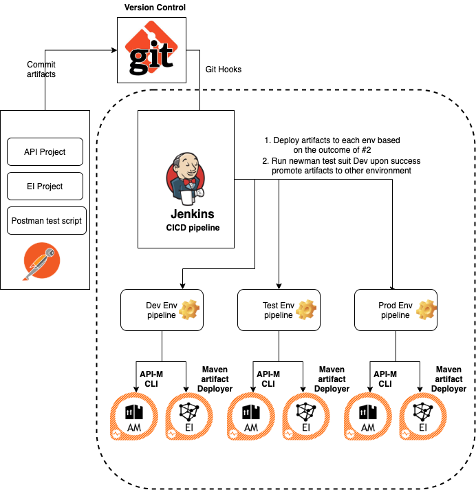
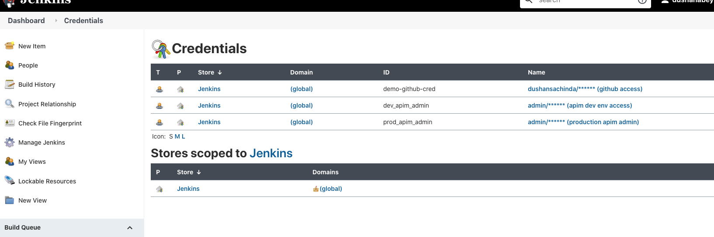
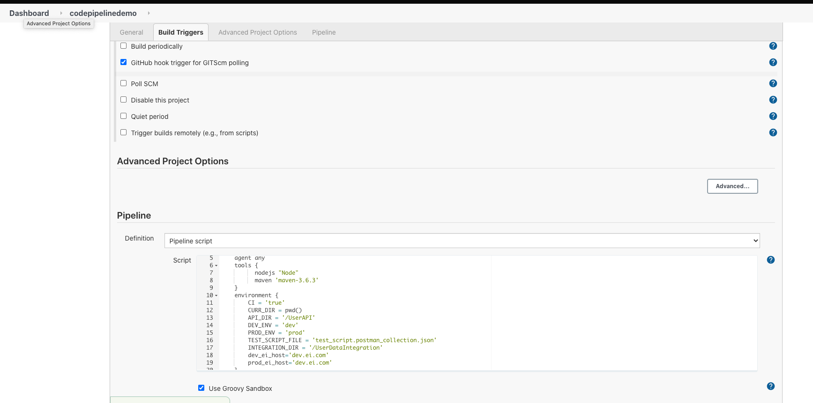
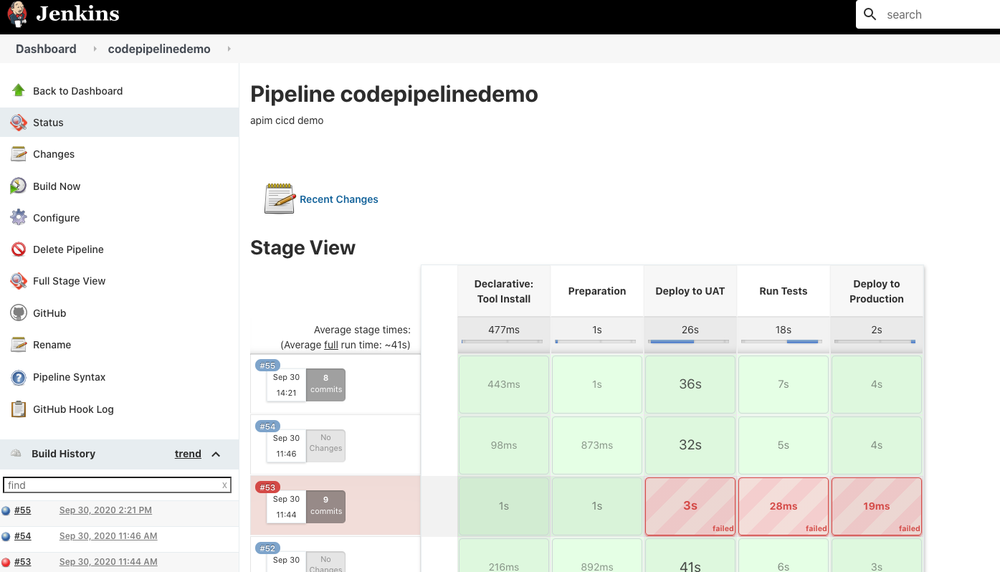

# CICD Pipeline for WSO2 API Manager / Enterprise Integration

Following guidelines will help you to determine how to setup the CICD pipeline for WSO2 APIM and Integration, we call this API platform.
APIs have become the defacto for connecting apps, services and data. Organizations have multiple environments such as 
Dev, Test and Prod for different purposes. Therefore, the APIs and integration goes hand to hand and  need to be available 
in each environment after developers specify the required conditions.WSO2 Enterprise Integrator is an open-source, light-weight, battle-tested, hybrid integration platform which comes with Apache 2.0 license.

Combine effort of automating the deployment process will be hugely reduce the manually promoting APIs and deploying composite artifacts, we have noticed in the past, integrating  artifacts between environments which is a tedious, error-prone, and 
a time-consuming task thus all these efforts is to streamline the operations much faster.


## Solution

For this demonstration the following architecture will be used.



## Prerequisites

1. Deploy the backend server
2. Install the Jenkins server
3. Install WSO2 API Manager
4. Install WSO2 Enterprise Integrator

### 1. Setup hosts for deployment

You need to setup following at the hosts for domain mappings
* <<host>> dev.apim.com  prod.apim.com
* <<host>> dev.be.com  prod.be.com
* <<host>> dev.ei.com  prod.ei.com

### 2. Deploy the backend server

Sample user service is used as the backend server and the complete source code of that server can be found 
[here](backend_server). Note that this is a Spring Boot application and the following commands can be used to start 
or build the application

* Start the application : `mvn spring-boot:run`
* Build the application : `mvn clean install`

Note that the jar is already built and stored [here](backend_server/target/backend-server-1.0.0.jar) and that can be 
simply started by executing `java -jar target/backend-server-1.0.0.jar`

All the available services will be shown in the Swagger UI.

Swagger UI URL: [http://localhost:8595/swagger-ui.html]() Note: you need to map this to dev.be.com or if you prefer to run two backend, please alter it as it required


### 2. Install the Jenkins server

Installing jenkins server is straightforward, you can either deploy it as docker or you can get Web application ARchive (WAR) and there are other options too . Please refer to their official [documentation](https://www.jenkins.io/doc/book/installing/)
for this.

### 3. Install WSO2 API Manager

For installing WSO2 API Manager please refer to this [documentation](https://apim.docs.wso2.com/en/latest/install-and-setup/install/installing-the-product/installing-the-product/)
for more information on that. For this demonstration I'll be having two environments called Dev and Test but any number 
of environments can be there and the steps are pretty much the same.

### 3. Install WSO2 Enterprise Integrator 

For installing WSO2 Enterprise Integrator  please refer to this [documentation](https://docs.wso2.com/display/EI660/Installation+Guide/)
for more information on that. 

## Configurations

This demo consists of two parts, i.e deploying artifacts for APIM and while using the CTL tool functionalists. Sametime, prepare carbon application for integration, deploy them
in the EI. Both having two different approach as of now, let's get into more detail in coming section

##### API Project
* API artifacts deployer will use [here](UserAPI), please refer to the the detail of the API definitions to understand the resources it exposing

* You need to start two APIM nodes dev with port offset 0 i.e dev.apim.com, prod with port offset 1 i.e prod.apim.com

* Execute the below commands to deploy this API on your development server. If your development server is not on the local machine, 
please change the URLs accordingly.

    * Add the dev environment : `apictl add-env -e dev --apim https://dev.apim.com:9443 --token https://dev.apim.com:8243/token`
    * Login to the dev environment : `apictl login dev -u admin -p admin -k`
    * Add the prod environment : `apictl add-env -e prod --apim https://prod.apim.com:9444 --token https://prod.apim.com:8244/token`
    * Login to the dev environment : `apictl login dev -u admin -p admin -k`

##### EI Project
* For EI artifacts, will use [here](UserDataIntegration), please refer to the the detail of the API definitions to understand the resources EI exposes. (For curiosity have modified user data post API to show case somewhat complex transformation with service chaining capabilities)


#### Jenkins Server
1. Login to the jenkins server. You might have to create a user if this is the first time.
2. Install [npm and nodejs plugins](https://wiki.jenkins.io/display/JENKINS/NodeJS+Plugin) 
and [Newman](https://learning.getpostman.com/docs/postman/collection-runs/integration-with-jenkins/#installation) globally in your Jenkins server. Same way you need to install maven which allows maven artifacts to be build and deploy

Newman is used to run the tests I have created using PostMan. The test script can be found [here](apim_artifacts/test_script.postman_collection.json).
3. Download and configure [WSO2 API Controller](https://wso2.com/api-management/tooling/) to the Jenkins server and the developer machines.


Note that you need to add the environments properly to the API Controller in the Jenkins Server. You can add environments 
by either manually editing the `<USER_HOME>/.wso2apictl/main_config.yaml` file or by running the following CTL command or follow the

4. Store the GitHub and APIM user credentials on Jenkins. Note that this can be done more securely using GitHub Apps.

5. Add the Jenkins pipeline configuration defined in [here](jenkinsfile). Don't forget to change the GitHub url accordingly.

5. Once the repo is created, will have to configure webhooks. This allows Jenkins to pick how any commits events and build the pipeline, which we will test a bit later.
. 
Note that the url has to be passed here and if the Jenkins is deployed locally, then you can use [ngrol](https://ngrok.com/) 
to expose your localhost through the internet.

6. You can either clone the repo ‘wso2_apim_cicd’ or can create a new repo based on the preference. But the idea is understand how jenkinepiple script
```  environment {
        CI = 'true'
        CURR_DIR = pwd()
        API_DIR = '/UserAPI'
        DEV_ENV = 'dev'
        PROD_ENV = 'prod'
        TEST_SCRIPT_FILE = 'test_script.postman_collection.json' 
        INTEGRATION_DIR = '/UserDataIntegration'
        dev_ei_host='dev.ei.com'
        prod_ei_host='dev.ei.com'
    }
```
Above, you will find the, as per the environment, it will pick ‘UserAPI’ directory for API deployment and the ‘UserDataIntegration’  also, you will find we have used DEV_ENV, PROD_ENV which allows jenkinsfile pipeline executors to understand when executing APIM-CLI to use correct environment properties


#### Trigger the pipeline
* You can start the pipeline manually by clicking on the *Build Now* button and all the stages should be passed.
* Now let's do a small change and commit it to the repo. Jenkins should pick that change via the webhook and the job should be started.


#### Things to note what happening inside the jenkins script

1. Lets looks at the UAT/PROD deployment pipeline

```
 stage('Deploy to UAT') {
            environment{
                RETRY = '80'
            }
            steps {
        
                echo 'Build  project -Dev $DEV_ENV'
                dir("UserDataIntegration"){
                    sh 'mvn clean install -Dmaven.test.skip -Dei.host=$dev_ei_host'
                }
                
                echo 'Deploying EI project -Dev $DEV_ENV'
                
                dir("UserDataIntegration/UserDataIntegrationCompositeExporter"){
                    sh 'mvn clean deploy -Dmaven.deploy.skip=true -Dmaven.car.deploy.skip=false -Dei.host=$dev_ei_host'
                }
                
                waitForDeployment()
                
                echo 'Logging into $DEV_ENV'
                withCredentials([usernamePassword(credentialsId: 'dev_apim_admin', usernameVariable: 'DEV_USERNAME', passwordVariable: 'DEV_PASSWORD')]) {
                    sh 'apictl login $DEV_ENV -u $DEV_USERNAME -p $DEV_PASSWORD -k'                        
                }
                echo 'Deploying to $DEV_ENV'
                sh 'apictl import-api -f $CURR_DIR$API_DIR -e $DEV_ENV -k --preserve-provider --update --verbose'
            }
        }
```
Within this stage following steps happening
 	
 * Jenkins pipeline pick the EI artifact namely with [here](UserDataIntegration), the carbon application start to build
 * Jenkins upon the success of the stage, then the maven deployer `mvn clean deploy -Dmaven.deploy.skip=true -Dmaven.car.deploy.skip=false -Dei.host=$dev_ei_host` will use to deploy the artifact to the EI node (in real life this will be deploy to the master EI node where other worker nodes will eventually synchronize the carbon application via depsynch mechanism)
 * You will notice something called `-Dei.host=$dev_ei_host` this one of the best practices we do recommend for passing environment specific variable, you can use this variable to populate synapse artifacts EPs etc etc where it different from environment to environment (pretty easy ah ..)
 * Then API-M CLI usage, you will find that it's the same command that is documented in CLI documentation with reference to the API deployment, but please understand how variables are being declared, which you can change per the project's behavior.

```
  echo 'Logging into $DEV_ENV'
                withCredentials([usernamePassword(credentialsId: 'dev_apim_admin', usernameVariable: 'DEV_USERNAME', passwordVariable: 'DEV_PASSWORD')]) {
                    sh 'apictl login $DEV_ENV -u $DEV_USERNAME -p $DEV_PASSWORD -k'  

  echo 'Deploying to $DEV_ENV'
                sh 'apictl import-api -f $CURR_DIR$API_DIR -e $DEV_ENV -k --preserve-provider --update --verbose'

```

2. Newman test script execution, tho this provides the entrance to the test script execution, please go through the [here](est_script.postman_collection.json), this will be a good learning curve if someone wanna build a test scrit with postman. (I’m not going to much internals of that)

```
 stage('Run Tests') {
            steps {
                echo 'Running tests in $DEV_ENV'
                sh 'newman run $CURR_DIR/$TEST_SCRIPT_FILE --insecure' 
            }
        }
```


